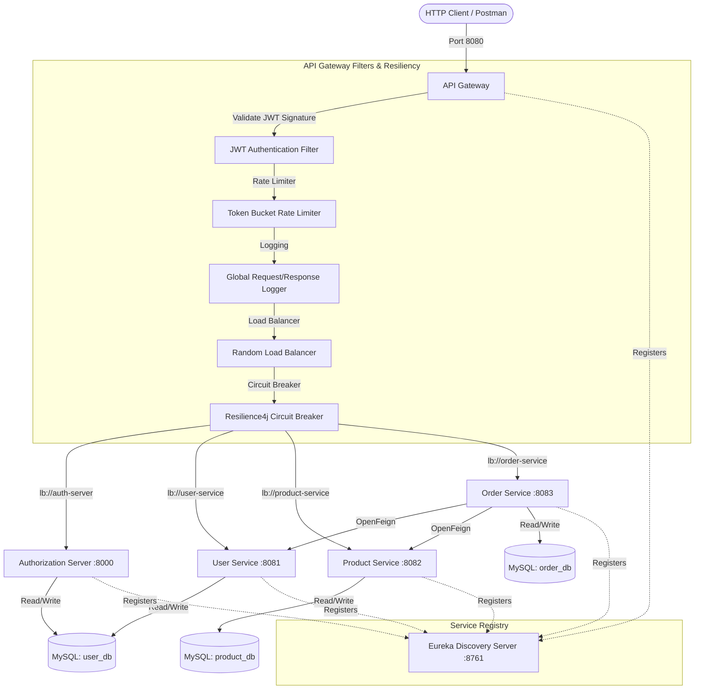

# Enterprise API Gateway and Edge Services Platform

This repository contains a production-ready, highly secure enterprise microservices platform built using **Java 21**, **Spring Boot 3.3.4**, **Spring Cloud 2023.0.3**, and **Spring Security 6**. The platform demonstrates professional implementations of centralized authorization, intelligent edge routing, resilience patterns, dynamic load balancing, and inter-service orchestration.

---

## Architecture Diagram

The system comprises 6 distinct modules:
1. **Discovery Server (Eureka)**: Centralized registry for all microservice instances.
2. **API Gateway (Spring Cloud Gateway)**: Single entry point providing Edge Services (JWT signature verification, rate limiting, logging, random load balancing, and fault tolerance).
3. **Authorization Server**: Token-issuing authority compliant with the OAuth 2.1 specification.
4. **User Service**: Manage credentials, registration, and user profiles.
5. **Product Service**: Inventory catalog management protected by role-based access checks.
6. **Order Service**: Order coordinator consuming User and Product resources via declarative OpenFeign clients.



---

## Architectural Flows

### 1. Edge Routing & Filtering Flow
1. A client submits an HTTP request to `http://localhost:8080/api/<resource>`.
2. The Gateway's **LoggingFilter** records the method, path, and timestamp.
3. The Gateway matches the path predicate (e.g. `/api/products/**` -> `lb://product-service`).
4. If the route is protected, the Gateway's Security Filter checks the JWT signature against the cached JWK keys retrieved from `http://localhost:8000/oauth2/jwks`.
5. If invalid/missing, access is denied immediately.
6. If valid, headers are enriched, and the request is passed down.

### 2. Random Load Balancing Flow
1. Instead of routing to hardcoded URLs, the Gateway leverages logical names: `lb://PRODUCT-SERVICE`.
2. The request is intercepted by Spring Cloud LoadBalancer.
3. The load balancer queries Eureka to fetch the list of healthy running instances.
4. Using the customized `RandomLoadBalancerConfig` policy, an instance is chosen randomly (rather than round-robin) to distribute load.

### 3. Circuit Breaker & Fallback Flow
1. Incoming calls to business services go through the Resilience4j `CircuitBreaker` filter.
2. The Gateway monitors calls inside a sliding window of size `10`.
3. If failure rate exceeds `50%` or calls take longer than `3s` (Time Limiter), the circuit opens.
4. When open, subsequent requests bypass the downstream service and instantly redirect to the **FallbackController** in the Gateway.
5. The gateway returns a localized JSON fallback response:
   ```json
   {
     "message": "Product Service is temporarily unavailable."
   }
   ```
6. After `10s` (wait duration), the circuit enters a half-open state, allowing test calls to verify if the downstream service has recovered.

---

## Standardized Folder Structure

Each microservice adheres strictly to **Clean Architecture** patterns. Package layout:

```text
com.secure.platform.<service>/
│
├── config/             # Component & integration bean definitions (JPA Auditing, Feign configs)
├── security/           # Stateless Spring Security Resource Server configurations
├── filter/             # Security filters, logging filters, and custom interceptors
├── controller/         # REST Controllers exposing resource mappings (no business logic)
├── service/            # Core business workflows and transactional methods (interface + impl)
├── repository/         # Spring Data JPA repositories interfacing with MySQL
├── entity/             # JPA database mappings using UUID keys and JPA auditing
├── dto/                # Data Transfer Objects for input validation and output formatting
├── mapper/             # Boilerplate converters mapping DTOs to/from Entities
├── exception/          # Global exception handler & custom business exception classes
├── util/               # Cryptographic helpers, constants, and utilities
└── client/             # Declarative Feign Clients for RPC/Inter-service calls (Order Service)
```

---

## Setup & Execution Instructions

### 1. Database Initialization
Ensure a local MySQL instance is active on port `3306` with credentials `root` / `root`. Run the script in `init.sql` to initialize schemas:
```sql
CREATE DATABASE IF NOT EXISTS user_db;
CREATE DATABASE IF NOT EXISTS product_db;
CREATE DATABASE IF NOT EXISTS order_db;
```

### 2. Build and Test Compilation
Compile the multi-module Maven project and run all unit/mock verification suites:
```bash
mvn clean install
```

### 3. Order of Service Startup
Launch the microservice applications sequentially:
1. **Discovery Server**: `discovery-server/src/main/.../DiscoveryServerApplication.java` (Port: `8761`)
2. **Authorization Server**: `auth-server/src/main/.../AuthServerApplication.java` (Port: `8000`)
3. **User Service**: `user-service/src/main/.../UserServiceApplication.java` (Port: `8081`)
4. **Product Service**: `product-service/src/main/.../ProductApplication.java` (Port: `8082`)
5. **Order Service**: `order-service/src/main/.../OrderApplication.java` (Port: `8083`)
6. **API Gateway**: `api-gateway/src/main/.../GatewayApplication.java` (Port: `8080`)

---

## API Documentation & Dashboards

- **Eureka Registry Console**: [http://localhost:8761](http://localhost:8761)
- **User Service Swagger**: [http://localhost:8081/swagger-ui.html](http://localhost:8081/swagger-ui.html)
- **Product Service Swagger**: [http://localhost:8082/swagger-ui.html](http://localhost:8082/swagger-ui.html)
- **Order Service Swagger**: [http://localhost:8083/swagger-ui.html](http://localhost:8083/swagger-ui.html)

---

## Sample Request/Response Payloads

### 1. User Login (Retrieve JWT)
- **POST** `http://localhost:8080/api/auth/login`
- **Request Body**:
  ```json
  {
    "email": "customer@example.com",
    "password": "password"
  }
  ```
- **Response Payload**:
  ```json
  {
    "accessToken": "eyJhbGciOiJSUzI1NiIs...",
    "refreshToken": "d820cf9e-...",
    "email": "customer@example.com",
    "role": "CUSTOMER"
  }
  ```

### 2. Add Product (Admin Only - Access Check)
- **POST** `http://localhost:8080/api/products` (Requires Bearer Token)
- **Request Body**:
  ```json
  {
    "name": "Mechanical Keyboard",
    "description": "RGB Backlit blue-switch keyboard",
    "price": 89.99,
    "quantity": 100
  }
  ```
- **Response Payload**:
  ```json
  {
    "id": "dd524359-4f51-4788-990f-6404fb738799",
    "name": "Mechanical Keyboard",
    "description": "RGB Backlit blue-switch keyboard",
    "price": 89.99,
    "quantity": 100,
    "createdAt": "2026-07-17T17:43:52Z",
    "updatedAt": "2026-07-17T17:43:52Z"
  }
  ```

### 3. Place Order (Customer Only)
- **POST** `http://localhost:8080/api/orders`
- **Request Body**:
  ```json
  {
    "productId": "dd524359-4f51-4788-990f-6404fb738799",
    "quantity": 2
  }
  ```
- **Response Payload**:
  ```json
  {
    "id": "a189f3cd-bd21-4f01-8c44-e22199bda662",
    "userId": "076ef201-512b-4286-b98f-e6474b3fb606",
    "productId": "dd524359-4f51-4788-990f-6404fb738799",
    "quantity": 2,
    "status": "PLACED",
    "createdAt": "2026-07-17T17:45:00Z",
    "updatedAt": "2026-07-17T17:45:00Z"
  }
  ```
